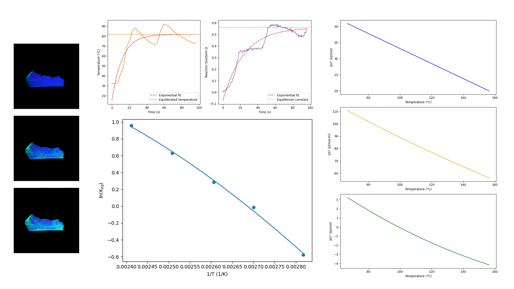

# crystal-im-py
Colorimetric image analysis for microscopy images of crystals

This repository was developed for data processing of confocal microscopy images of single-crystal-to-single-crystal transitions in solid-state crystals. It is designed to process batches of images exported from Zeiss ZEN microscopy software and extract conversion parameters based on color as a function of time and temperature.

## Getting Started: Setting Up the Repository
If this is your first time using Python or GitHub, don't worry — follow these steps carefully and you'll be up and running in no time. 

First, you'll need to install Git (the tool that lets you download and manage code repositories) by going to git-scm.com/downloads, selecting your operating system, and following the installer prompts; on Windows, accept all default settings. 

Next, install Python by downloading the latest version from python.org/downloads — critically, during installation on Windows, check the box that says "Add Python to PATH" before clicking Install. Once both are installed, open a terminal (on Mac: search for "Terminal" in Spotlight; on Windows: search for "Command Prompt" or "PowerShell" in the Start menu). To download ("clone") this repository to your computer, navigate to the folder where you'd like to save it by typing cd Desktop (or whichever folder you prefer) and pressing Enter, then run git clone https://github.com/nina-aagaard/crystal-im-py.git. Once cloning is complete, move into the new folder by typing cd crystal-im-py and pressing Enter. 

Now install all required libraries in one step by running pip install -r requirements.txt — this automatically installs everything the code needs. Finally, launch Jupyter Notebook by typing jupyter notebook and pressing Enter, which will open an interactive interface in your web browser where you can open and run the analysis notebooks (.ipynb files) by clicking on them.